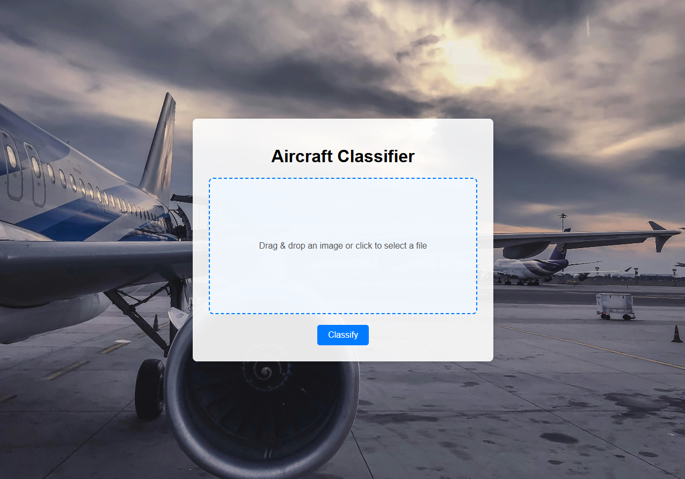
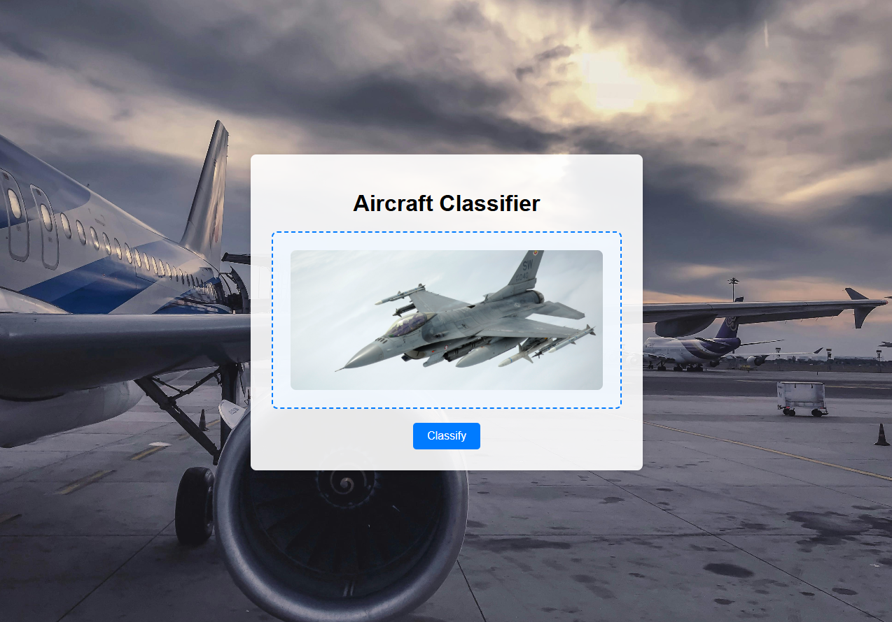

# ✈️ Airplane Classifier Flask App

A simple and effective web application for classifying airplane images into one of four categories: **F16**, **Mi24**, **B1**, or **C130**. 
The classification is powered by a pre-trained CNN model developed in Google Colab, and the app is built using Flask and managed with Poetry.

## 🛠 Installation

**`Python3` must be already installed**

### 🔄 Clone and set up the environment

```shell
git clone https://github.com/mykytafabrykator/aircraft-classifier.git
cd aircraft-classifier

# Create virtual environment
python -m venv venv

# Activate it
venv\Scripts\activate       # Windows
source venv\bin\activate    # macOS

# Install dependencies
pip install poetry
poetry install
```

### 🚀Run the Application:
```shell
python -m flask run 
```

## ✨ Features

- Easily upload airplane images via a web form.
- Uses a pre-trained CNN model to determine the airplane type.
- Returns classification results with the label and probability score.
- Organized with separate modules for app logic and image classification.
- Built with Flask and managed with Poetry for smooth setup and deployment.
- Achieved a validation accuracy of 90.02% with a validation loss of 0.3368 at epoch 38 — the best model with the highest accuracy and lowest loss.

## ✍️ Tech Stack

- Python 3.12
- Flask
- TensorFlow
- NumPy
- Poetry

## 📦 Project Files
- app.py – Main Flask application handling routes and image uploads.
- classifier.py – Contains functions for image preprocessing and classification.
- static/models/ – Contains the pre-trained CNN models.

## 🖼️ Example Output
Upon uploading an image (`classify` endpoint), the app returns a JSON response similar to:
```json
{
  "label": "F16",
  "prob": 92.75
}
```
## 🌐 Website screens:


